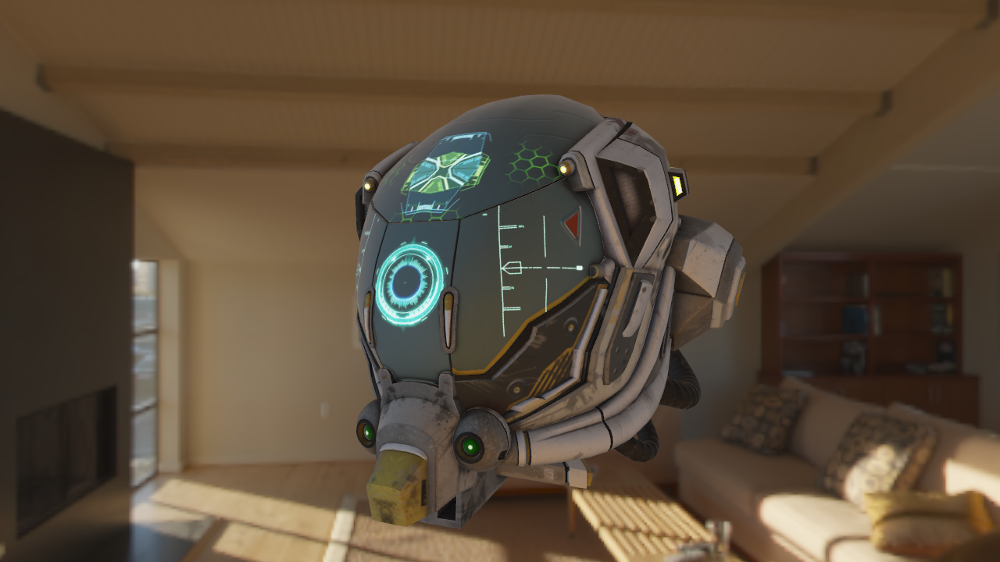
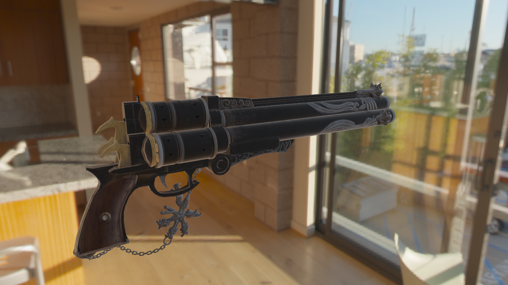

# LearnOGL - OpenGL 渲染项目

一个基于现代 OpenGL 的高级渲染引擎项目，实现了 PBR（基于物理的渲染）、HDR、Bloom 等高级渲染技术。

## 📸 效果展示

<div align="center">


<p>
  
  
</p>

</div>

## ✨ 功能特性

### 渲染技术
- **PBR（物理渲染）** - 基于金属度/粗糙度的材质系统
- **IBL（基于图像的光照）** - 环境光照与反射
- **HDR（高动态范围渲染）** - 真实的光照范围
- **Bloom（泛光效果）** - 明亮区域的光晕效果
- **Deferred Shading（延迟渲染）** - 多光源优化渲染
- **SSAO（屏幕空间环境光遮蔽）** - 增强深度感
- **Blinn-Phong 光照** - 经典光照模型

### 渲染特性
- **Skybox（天空盒）** - 环境背景渲染
- **Normal Mapping（法线贴图）** - 表面细节增强
- **模型加载** - 支持 GLTF 格式
- **相机系统** - 自由视角控制
- **多重采样抗锯齿** - MSAA 4x

## 🛠️ 技术栈

- **OpenGL 3.3 Core** - 图形渲染 API
- **GLFW** - 窗口管理与输入处理
- **GLAD** - OpenGL 函数加载器
- **GLM** - 数学库
- **stb_image** - 图像加载
- **Assimp** - 模型加载（通过 learnopengl 封装）
- **CMake** - 构建系统

## 📁 项目结构

```
LearnOGL/
├── src/              # 源代码
│   ├── main.cpp      # 主程序
│   ├── glad.c        # GLAD 实现
│   └── stb_image.cpp # stb_image 实现
├── include/          # 头文件
│   ├── learnopengl/  # 自定义工具类
│   │   ├── shader.h  # 着色器封装
│   │   ├── camera.h  # 相机类
│   │   ├── model.h   # 模型加载
│   │   └── mesh.h    # 网格类
│   ├── glad/         # GLAD 头文件
│   ├── GLFW/         # GLFW 头文件
│   └── glm/          # GLM 数学库
├── shader/           # 着色器代码
│   ├── pbr/          # PBR 着色器
│   ├── bloom/        # 泛光着色器
│   ├── deferred/     # 延迟渲染着色器
│   ├── ssao/         # SSAO 着色器
│   └── ...
├── resources/        # 资源文件
│   ├── objects/      # 3D 模型
│   │   ├── Cerberus/
│   │   ├── DamagedHelmet/
│   │   └── ...
│   └── texture/      # 纹理
│       ├── hdr/      # HDR 环境贴图
│       └── pbr/      # PBR 材质贴图
└── demo/             # 演示截图
```

## 🚀 构建与运行

### 环境要求

- C++11 或更高版本
- CMake 3.10+
- 支持 OpenGL 3.3 的显卡驱动

### Windows (MinGW/MSVC)

```bash
# 克隆仓库
git clone <your-repo-url>
cd LearnOGL

# 创建构建目录
mkdir build
cd build

# 生成构建文件
cmake ..

# 编译
cmake --build .

# 运行
./LearnOpenGL  # Linux/Mac
LearnOpenGL.exe # Windows
```

### 控制方式

- **WASD** - 移动相机
- **鼠标** - 旋转视角
- **滚轮** - 缩放视野
- **ESC** - 退出程序

## 📚 学习资源

本项目基于 [LearnOpenGL CN](https://learnopengl-cn.github.io/) 教程开发，涵盖了：

- 基础光照理论
- 高级光照技术
- PBR 理论与实践
- 延迟渲染管线
- 后处理效果

## 📋 待办事项

- [ ] 添加阴影映射
- [ ] 实现粒子系统
- [ ] 添加后处理效果（如运动模糊、景深）
- [ ] 优化性能分析工具
- [ ] 支持更多模型格式

## 📄 许可证

本项目仅供学习交流使用。

## 🙏 致谢

- [LearnOpenGL](https://learnopengl.com/) - 优秀的 OpenGL 教程
- [glTF Sample Models](https://github.com/KhronosGroup/glTF-Sample-Models) - 示例模型资源

---

⭐ 如果这个项目对你有帮助，欢迎 Star！
